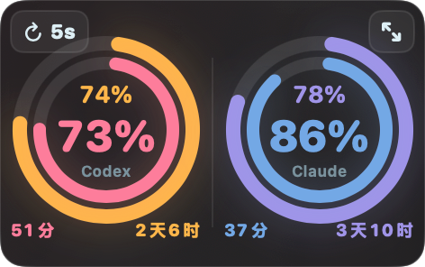
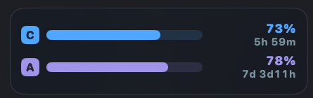
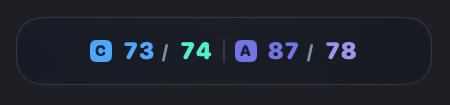
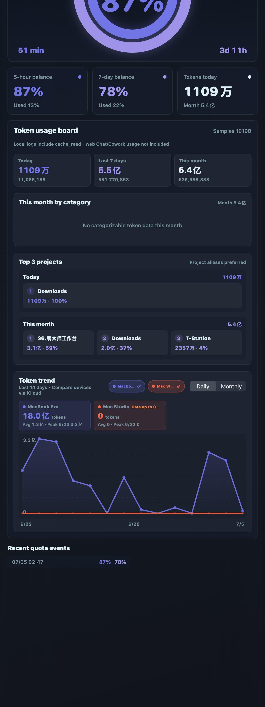
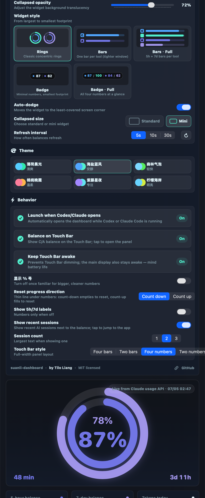
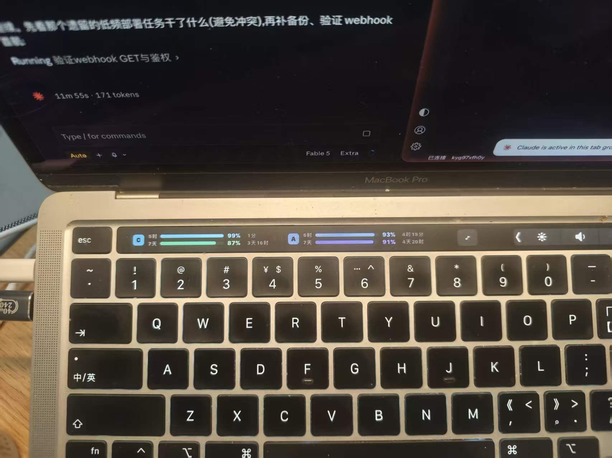

# 算力码表 suanli-dashboard

> macOS 悬浮仪表盘：同时监控 **OpenAI Codex** 与 **Claude Code** 的订阅额度余额、Token 消耗与趋势。支持 Touch Bar 常驻显示、最近会话直达、多设备 iCloud 同步。

   

<p align="center">
  
</p>

<p align="center">
  
  <br><sub>Touch Bar 常驻：双工具余额 + 最近 AI 会话直达 · Always-on balance & recent-session shortcuts</sub>
</p>

<table align="center">
  <tr>
    <td align="center"><br><sub>长条样式 · Bars</sub></td>
    <td align="center"><br><sub>徽章样式 · Badge</sub></td>
  </tr>
</table>

<table align="center">
  <tr>
    <td align="center" valign="top"><br><sub>展开面板：余额 · 看板 · 多设备趋势 · Full panel</sub></td>
    <td align="center" valign="top"><br><sub>设置：样式 · 语言 · 主题 · Touch Bar · Settings</sub></td>
  </tr>
</table>

<details>
<summary>📷 Touch Bar 真机实拍 · Touch Bar on real hardware</summary>
<p align="center"></p>
</details>

**English**: A macOS-only floating dashboard for monitoring your **OpenAI Codex** and **Claude Code** subscription quotas (5-hour & 7-day rolling windows), token usage and multi-device trends — with an always-on Touch Bar panel and recent-session shortcuts. UI follows your system language (10 languages) with an in-app language picker. **Requires macOS 14+.** Windows/Linux are not supported (the app is built on AppKit/SwiftUI, Keychain, iCloud Drive and Touch Bar APIs) — PRs welcome, see [Platform support](#平台支持--platform-support). Download from [Releases](../../releases), unzip, run `安装并启用自动启动.command`, and see the English notes in [First launch](#三首次启动必读) for Gatekeeper/Keychain steps.

---

## ⚠️ 开始前请确认（必读）

这个工具**只能在 Mac 上运行**，并且有明确的前提条件。下载前先对照检查：

| 条件 | 要求 | 说明 |
|---|---|---|
| 操作系统 | **macOS 14 (Sonoma) 及以上** | 更早的系统无法运行 |
| 机型 | Apple Silicon (M 系列) | Release 提供的安装包为 arm64；Intel Mac 请从源码构建 |
| 监控 Codex | 本机安装并登录过 Codex（桌面版或 CLI） | 没装则在设置里关掉 Codex 即可 |
| 监控 Claude | 本机用 **Claude Code CLI** 登录过一次 | 详见下方「Claude 余额显示前提」，只用网页版/桌面版是读不到余额的 |
| 网络 | 能正常访问 OpenAI / Anthropic 服务 | 余额接口请求发往官方服务器，网络不通时显示「暂无数据」 |
| Touch Bar 功能 | 带 Touch Bar 的 MacBook Pro | 没有 Touch Bar 的机器该选项自动置灰，其他功能不受影响 |
| 多设备同步 | 各设备登录同一 iCloud 账号，开启 iCloud Drive | 只用一台 Mac 可完全忽略 |

**工具至少要装一个**（Codex 或 Claude Code）。首次启动会自动探测你装了哪个，只显示对应的码表。

## 一、这是什么

重度使用 Codex / Claude Code 的人都遇到过：干着干着突然「额度用完了」。算力码表把两个工具的 **5 小时滚动窗口**和 **7 天窗口**余额变成一个始终可见的小仪表，让你随时知道还剩多少、什么时候刷新。

- **双工具监控**：Codex 与 Claude Code 可单选/多选
- **5 种悬浮样式**：双环 / 长条 / 长条·全 / 徽章 / 徽章·全，标准与迷你两档，自动避让不挡内容
- **Touch Bar 常驻**（带 Touch Bar 机型）：4 种面板样式、大数字模式、距刷新进度线（倒计时/正计时两种方向）、最近 AI 会话一键直达、可选保持常亮、合盖外接屏时浮窗自动接管
- **Token 消耗看板**：今日/近 7 天/本月、用途分布、项目 Top 3、多设备趋势对比
- **10 种界面语言**：跟随系统自动切换，设置里也可手动选
- **隐私原则**：只读本机日志与凭据、不上传任何数据、拿不到数据就显示「暂无数据」，绝不编数字

## 二、安装（3 步）

1. 从 [Releases](../../releases) 下载最新的 `算力码表-安装包-vX.X.X.zip` 并解压；
2. 双击解压出来的 **`安装并启用自动启动.command`**；
   - 若提示「无法打开，因为它来自身份不明的开发者」：**右键点击文件 → 打开 → 再点打开**（只需一次）；
3. 脚本会把 App 装到 `~/Applications/算力码表.app` 并配置自动启动（检测到 Codex 或 Claude Code 运行时自动唤起码表）。

不想要自动启动的话，也可以直接把解压出来的 `算力码表.app` 拖到「应用程序」手动使用。

## 三、首次启动必读

**1. Gatekeeper 安全拦截（一定会遇到）**

本 App 未做 Apple 公证（个人开源项目，不交年费）。首次打开如被拦截：

- 打开「**系统设置 → 隐私与安全性**」，页面下方会出现「已阻止使用算力码表」→ 点「**仍要打开**」；
- 或右键点击 App → 打开 → 打开。

**2. 钥匙串授权弹框（开了 Claude 监控会遇到）**

码表需要读取 Claude Code 存在钥匙串里的凭据来查询余额。弹出「算力码表想访问钥匙串中的 Claude Code-credentials」时，点「**始终允许**」（点一次以后不再弹）。这是只读操作，凭据绝不会被写日志或上传。

**3. Claude 余额显示前提（最常见的「为什么是灰的」）**

Claude 环显示「暂无数据」灰色，99% 是因为**本机没有 Claude Code CLI 的登录凭据**。网页版 claude.ai 和桌面 App 的登录是独立的，码表读不到。解决：

```bash
# 终端里运行（哪怕你平时只用桌面版，登录这一次即可）
claude
# 进入后输入 /login，按提示在浏览器完成授权，然后 /exit 退出
```

登录成功后码表 1 分钟内自动亮起，之后 token 过期会自动续期，**不需要再碰终端**。

**4. Codex 余额来源**

自动读取本机 Codex（桌面版或 CLI）的状态，无需任何配置。如果显示「没有余额事件」，在 Codex 里输入一次 `/status` 即可。

## 四、多设备同步（可选）

在每台 Mac 上安装并打开码表即可——前提是它们登录**同一个 iCloud 账号**且开了 iCloud Drive。每台设备把自己的 token 消耗聚合成小 JSON 写进 iCloud（只有日期和数字，无任何内容），趋势图里自动出现所有设备的折线和总量。设备数量不限。

> 某台设备超过 48 小时没打开码表，趋势图会在它的卡片上标注「数据至 X」提醒你数据不是最新的。

## 五、常见问题

**Q: 打不开，提示已损坏？**
A: `xattr -dr com.apple.quarantine ~/Applications/算力码表.app` 后再开（安装脚本已自动做过，手动拖装的可能遇到）。

**Q: Claude 环之前亮着，某天变灰了？**
A: 多数是续期链断了（长时间没开机等）。重新 `claude` → `/login` 一次即可，见上文第三节。

**Q: 两台电脑的余额百分比不一样？**
A: 余额是账号级的，同一账号在哪台机器看都一样；不一样说明两台登录的是不同账号。Token 消耗折线按设备分开是正常设计。

**Q: Touch Bar 上没显示？**
A: 只有带 Touch Bar 的 MacBook Pro 支持；在 设置 → 运行 里打开「Touch Bar 常驻余额」。

**Q: 卸载怎么卸？**
A: 删除 `~/Applications/算力码表.app`、`~/Library/LaunchAgents/dev.codex.balance-dashboard.watch-codex.plist`、`~/Library/Application Support/CodexBalanceDashboard/`，再在 iCloud Drive 删掉「算力码表」文件夹（如果不再需要同步数据）。

## 平台支持 / Platform support

| 平台 | 状态 |
|---|---|
| macOS 14+ (Apple Silicon) | ✅ 官方支持，Release 直接下载 |
| macOS 14+ (Intel) | 🟡 源码构建可用（`./script/create_transfer_package.sh`） |
| Windows / Linux | ❌ 暂不支持 |

**为什么不支持 Windows/Linux**：界面（AppKit/SwiftUI）、凭据读取（Keychain）、多设备同步（iCloud Drive）、Touch Bar 全部是 macOS 专属技术。

**想移植？欢迎 PR！** 数据层是跨平台的：两个工具在 Win/Linux 上同样把日志写在 `~/.codex` 和 `~/.claude`（结构一致），余额接口是标准 HTTP，多设备同步协议就是本仓库的聚合 JSON（`schemaVersion 2`）。用 Tauri/Electron 重写界面层即可，欢迎在 Issues 里认领。

*Why macOS-only: the UI (AppKit/SwiftUI), credential access (Keychain), device sync (iCloud Drive) and Touch Bar are all Apple-specific. The data layer is portable — both tools write the same log structure to `~/.codex` / `~/.claude` on every OS, the quota APIs are plain HTTP, and the sync protocol is just JSON. A Tauri/Electron port is very feasible — PRs welcome!*

## 源码构建

```bash
git clone https://github.com/waytosea-oss/suanli-dashboard.git
cd suanli-dashboard
./script/create_transfer_package.sh   # 产物在 dist/，含安装脚本
```

需要 Xcode Command Line Tools（Swift 6）。跑测试：把 `TestRunner` product 构建后执行。

## 数据来源与隐私

| 数据 | 来源 | 说明 |
|---|---|---|
| Codex 余额 | Codex app-server 本地 RPC / 会话日志 | 与官方 `/status` 一致 |
| Claude 余额 | 本机已有的 Claude Code OAuth 凭据 + 官方 usage 接口 | accessToken 过期自动用 refreshToken 续期 |
| Token 消耗 | 两个工具的本地会话日志（jsonl） | 逐条解析、按消息去重 |
| 多设备数据 | iCloud Drive 聚合 JSON | 只含日期与数字 |

- **只读**两个工具的日志与凭据，绝不修改、绝不发起登录
- 凭据绝不写入日志、诊断报告或 iCloud
- 不上传任何数据到第三方；找不到可靠来源就显示「暂无数据」，**永远不编数字**

## 作者

**Tilo Liang**（[@waytosea-oss](https://github.com/waytosea-oss)）

一个被额度反复背刺之后决定把仪表盘做出来的人。如果这个工具帮到了你，给个 ⭐️ 就是最好的支持。

## 许可证

[MIT](LICENSE) © 2026 Tilo Liang
